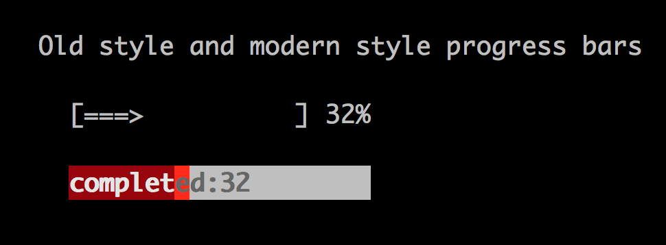

# Progress Bar

Last update: 2014-03-28 00:04

This describes how to create and update a progress bar. 

## Creating a Progress Bar

The following example shows two progress bars. The first is in an old style with and arrow that moves from left to right.

The main method of a progress bar is `fraction(percent)` which tells it how much to fill and what percentage to print on the right. `text` is printed on the bar. `width` is essential.

      pbar1 = Progress.new @form, {:width => 20, :row => r, :col => fc, 
        :name => "pbar1", :style => :old}
      
      pbar = Progress.new @form, {:width => 20, :row => r+2, :col => fc, 
        :bgcolor => :white, :color => :red, :name => "pbar"}
      
      pb =  @form.by_name["pbar"]
      
      pb.fraction(0.32)
      i = 32
      pb.text = "completed:#{i}"

      pbar1.fraction(0.32)

## Progress Bar operations

- fraction(float) - the percent to fill
- width(int)      - the width of the bar

Optional

- char(char)      - character used to fill, default space
- surround_chars  - characters used in old style on left and right, default is "[]"
- style(symbol)   - only :old is recognized, anything else is modern
- text(String)    - text to print over bar (optional)

### See also:

- [progress_dialog]
- [testprogress.rb](https://github.com/rkumar/rbcurse-core/blob/master/examples/testprogress.rb)

Source: [rprogress.rb](https://github.com/rkumar/rbcurse-core/blob/master/lib/rbcurse/core/widgets/rprogress.rb)
